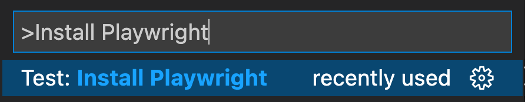
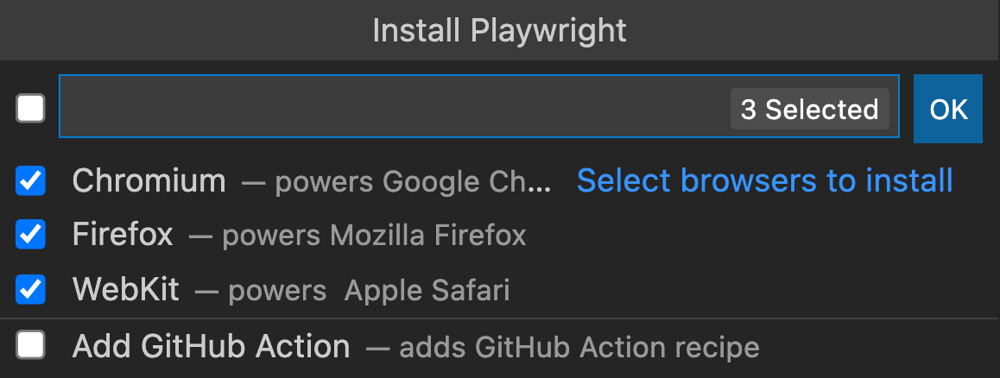

# Testing of Webpage using Playwright
> Part of this document is referenced from [Playwright webpage](https://playwright.dev/docs/intro).

## Installation
### Via VSC Marketplace
Download `Playwright` from Visual Studio Code (VSC) Marketplace. 

If no `Playwright Test` npm package is installed into your project, or is starting a new testing project, "Install Playwright" action will help you get started.


Press `ctrl + p` and a prompt will come out at the top. Key in `>Install Playwright` into the input prompt.

Pick the browsers you would like to use by default. You can change this at a later time if you need to.



The extension will automatically detect if you have `Playwright Test` intalled and loads the `Playwright Test` projects into VSC. By default it will select the first project as a run profile and inside the test explorer you can change this behaviour to run a single test in multiple or different browsers.

### Via init command
```powershell
# Run from your project's root directory
npm init playwright@latest
# Or create a new project
npm init playwright@latest new-project
```

This will create a configuration file, optionall add examples. a GitHub Action workflow and a first test `example.spec.ts`. You can now jump directly to [writing assertions](https://playwright.dev/docs/intro#writing-assertions) section.

### Manually 
Add dependancy and install browsers.

```powershell
npm i -D @playwright/test
# install supported browsers
npx playwright install
```
You can optionally install only selected browsers, see [install browsers](https://playwright.dev/docs/cli#install-browsers) for more details. Or you can install no browsers at all and use existing [browser channels](https://playwright.dev/docs/browsers).

## Testing Codes
Create `tests/example.spec.js` (or `tests/example.spec.ts` for TypeScript) to define your test.

Assuming that your test files are in the `tests` directory.

To run in headless:
```powershell
npx playwright test
```

To run with browser:
```powershell
npx playwright test --headed
```

## More content
There are more content with regards to using `Playwright`. This guide is just to quickly refresh how `Playwright` is installed and run.

Here is the quicklink to the [installation page](https://playwright.dev/docs/intro#installation).